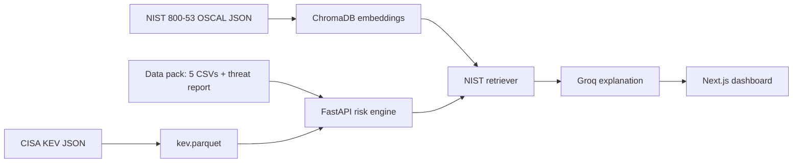
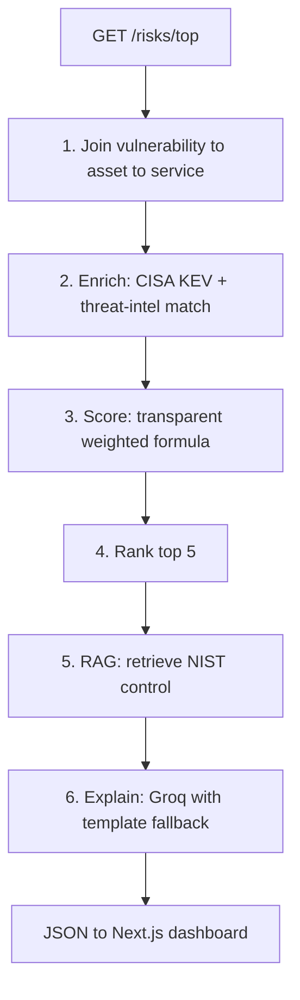

# AI-Powered Cyber Risk Assistant

A system that joins TawasolPay's security data — asset inventory, open
vulnerabilities, threat intelligence, and business-service context — into a
single prioritised, explainable risk picture, and retrieves the relevant
NIST SP 800-53 remediation control for each of the top risks.

The problem it solves: the data to understand exposure already exists, but it is
spread across five files and has never been joined into a ranked, defensible
view. Doing that by hand across 60 assets, 114 vulnerabilities, and 40 threat
records is too slow to brief a board in 48 hours. This system does it
automatically and shows its reasoning.

- **Repository:** https://github.com/KrunalWankhade9021/Hive-pro-Assignment
- **Live demo:** _added after deployment_

---

## What it produces

For the current data pack, the system ranks the top risks and, for each one,
reports the asset, the vulnerability, the matched threat campaign (if any), the
business service at risk, a plain-English explanation of why it ranks where it
does, and the most applicable NIST SP 800-53 control retrieved from the actual
control catalogue.

The ranking is deliberately **not** CVSS alone. An internet-exposed CVSS 8 on a
payment gateway with an active ransomware campaign ranks above an internal
CVSS 10 on a development server. The current top of the list is CVE-2023-4966
(CitrixBleed) on the customer-login and payment load balancers, followed by the
Fortinet SSL-VPN RCE (CVE-2024-21762) on the production VPN edges — both actively
exploited, internet-facing, and tied to named ransomware campaigns.

## Architecture



Request-time pipeline:



The scoring is a transparent additive formula, not a black box. Each factor that
contributes is stored and shown on the dashboard as a stacked bar, so every
score can be read back to its causes:

```
weighted score = (CVSS / 10) * 25          # severity, bounded
               + 20  internet-exposed (asset-level source of truth)
               + 15  exploit available OR present in CISA KEV
               + 15  ransomware-associated in CISA KEV
               + 15  matched to an active threat campaign
               + 10/6/3  business revenue impact (Critical/High/Medium)
               + 5   PCI DSS or GDPR compliance scope
               + 5   no EDR   + 3  no auth required   + 2  open > 30 days
```

Scores are ranked in descending order, with deterministic tie-breakers
(revenue impact, then CVSS, then days open, then production over staging) so the
ordering never depends on input row order.

## Running locally

Prerequisites: Python 3.11+, Node 20+.

**1. Backend — build the knowledge base and start the API.**

```bash
cd backend
python3.11 -m venv .venv
. .venv/bin/activate
pip install -e ".[dev]"

# Fetch CISA KEV + NIST 800-53 and build the vector store (one-time; downloads
# the embedding model and embeds ~1,196 controls — takes a few minutes).
python scripts/build_kb.py

# Optional: enable LLM-generated explanations (otherwise a deterministic
# template is used). Free key from https://console.groq.com
echo 'GROQ_API_KEY=your_key_here' > .env

uvicorn app.main:app --host 127.0.0.1 --port 8000
```

The API is then at http://127.0.0.1:8000 — `GET /risks/top?n=5`, `GET /stats`,
`GET /health`, and interactive docs at `/docs`. The first `/risks/top` call
loads the embedding model and calls the LLM, so it takes a few seconds; results
are cached thereafter.

**2. Frontend — the dashboard.**

```bash
cd web
npm install
npm run dev
```

Open http://localhost:3000. The frontend defaults to `http://localhost:8000`
for the API; override with `NEXT_PUBLIC_API_URL` if needed.

**Tests:**

```bash
cd backend && . .venv/bin/activate && pytest
```

---

## Supporting question 1 — the data split

**Embedded (semantic retrieval): only the NIST SP 800-53 control catalogue.**
These are roughly 1,196 unstructured, natural-language control descriptions,
where the right control for a given finding is a matter of meaning rather than an
exact key — there is no field to filter on for "the control about correcting
software flaws." We embed the control prose with a sentence-transformer
(`bge-small-en-v1.5`) into ChromaDB and retrieve by cosine similarity.

**Queried as structured records: the five CSVs and the CISA KEV catalogue.**
These are rows with exact keys — CVE IDs, `asset_id`, booleans, enumerations —
so the operations that matter are exact joins and filters: does this CVE appear
in KEV, is this asset internet-exposed, which service does it support. Those are
precise, fast, auditable, and reproducible as structured queries. Embedding them
would introduce similarity where the data demands exact matching and would make
the results harder to justify.

## Supporting question 2 — where it can go wrong

**1. A real CVE in our environment is absent from the CISA KEV snapshot.**
Three of the twenty real CVEs in `vulnerabilities.csv` are not in the KEV
catalogue we pulled — including `CVE-2024-6387` (OpenSSH regreSSHion), a
high-severity unauthenticated RCE. If the system treated KEV as the sole signal
for "actively exploited," these would be silently under-ranked. The ranking
therefore never relies on KEV alone: it also credits the vulnerability's own
`exploit_available` flag and any matched threat campaign, with KEV as
confirmation rather than a gate. To make the gap visible rather than invisible,
any CVE that has an exploit or a ransomware campaign but no KEV entry can be
surfaced as "KEV-unconfirmed" so an analyst reviews it instead of trusting a
false all-clear.

**2. The retriever returns a plausible but wrong NIST control.** Semantic search
can surface a near-miss. This happened in development: an earlier, smaller
embedding model mapped the Fortinet SSL-VPN RCE to "Attack Surface Reduction" at
a cosine similarity of about 0.25. The mitigations are concrete — we moved to a
stronger embedding model, which raised the correct-control similarity for the
top risks to roughly 0.62–0.68; retrieval is constrained to base controls rather
than obscure enhancements; every result shows its match percentage on the
dashboard, so a weak retrieval is visible rather than hidden; and unit tests pin
representative finding types to their expected control families (patching to
SI-2 / RA-5, privilege escalation to AC-6, session-token leakage to SC-23).

**3. The structured inputs disagree or are stale, and the ranking inherits it.**
The vulnerability table marks 62 rows as "Internet" while the asset inventory
marks only 21 assets as internet-exposed. Trusting the vulnerability column would
over-rank internal assets. We resolve this by treating the asset-level
`internet_exposed` field as the single source of truth and logging the
discrepancy. More broadly, the ranking is only as accurate as the CSVs feeding
it — a mis-tagged criticality or a stale asset record would skew a score without
any outward sign — which is why an input-consistency check that flags rows where
the two exposure fields conflict is the right guard, and the same pattern extends
to other cross-field inconsistencies.

## Supporting question 3 — the one thing I would change

Propagate business criticality through the service-dependency graph. Today a
risk's business impact is taken only from the service that directly owns the
affected asset, but `business_services.csv` includes a `depends_on` graph that
the model does not yet use. A vulnerability on Identity Verification should
inherit the blast radius of Customer Login and Payment Processing that depend on
it; a flat per-asset score understates exactly the cascading impact a CISO cares
about most. Traversing that dependency graph to roll dependent-service
criticality into the score is the single change that would most improve the
ranking's real-world fidelity.

---

## Technology

- **Backend:** Python 3.11, FastAPI, pandas, pydantic.
- **Retrieval (RAG):** `sentence-transformers` (`bge-small-en-v1.5`), ChromaDB —
  all local, no API key, reproducible.
- **LLM (explanations only):** Groq, Qwen 3 (`qwen/qwen3.8-27b`), with a
  deterministic template fallback so the system degrades gracefully if the model
  is unavailable. The LLM only phrases the explanation from evidence the engine
  has already computed; it does not decide the ranking or invent facts.
- **Frontend:** Next.js (App Router), TypeScript, Tailwind CSS.

The intelligence is deliberate about which tool does what: the ranking is a
transparent formula (auditable, reproducible), the remediation guidance is
genuinely retrieved from the source document (not recalled by the model), and
the LLM is confined to the last-mile task of writing a sentence.

## Data sources

- **Structured data pack** (`Dataset/`): assets, vulnerabilities, threat
  intelligence, business services, one-line remediation hints, and the MDR
  advisory. The one-line hints are used only to sharpen the retrieval query;
  the guidance shown always comes from the NIST catalogue.
- **CISA Known Exploited Vulnerabilities catalogue** — fetched at build time;
  cross-referenced by exact CVE to confirm active exploitation and ransomware
  association.
- **NIST SP 800-53 Rev. 5 control catalogue** — fetched at build time from
  NIST's official OSCAL release, embedded, and retrieved per risk.
