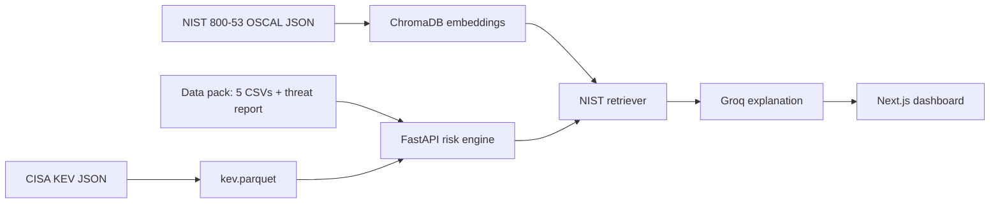
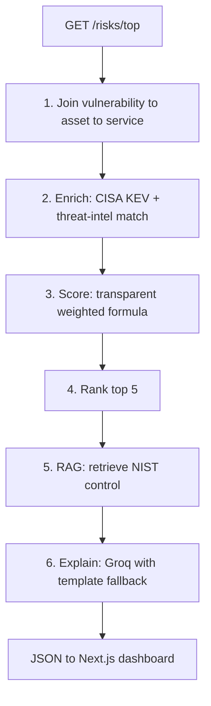

# AI-Powered Cyber Risk Assistant

A system that joins TawasolPay's security data (asset inventory, open
vulnerabilities, threat intelligence, and business-service context) into a
single prioritised, explainable risk picture, and retrieves the relevant
NIST SP 800-53 remediation control for each of the top risks.

The problem it solves: the data to understand exposure already exists, but it is
spread across five files and has never been joined into a ranked, defensible
view. Doing that by hand across 60 assets, 114 vulnerabilities, and 40 threat
records is too slow to brief a board in 48 hours. This system does it
automatically and shows its reasoning.

- **Repository:** https://github.com/KrunalWankhade9021/Hive-pro-Assignment
- **Live demo:** https://tawasolpay-risk.duckdns.org

---

## What it produces

For the current data pack, the system ranks the top risks and, for each one,
reports the asset, the vulnerability, the matched threat campaign (if any), the
business service at risk, a plain-English explanation of why it ranks where it
does, and the most applicable NIST SP 800-53 control retrieved from the actual
control catalogue.

The ranking is deliberately **not** CVSS alone. An internet-exposed CVSS 8 on a
payment gateway with an active ransomware campaign ranks above an internal
CVSS 10 on a development server. The current top of the list is CVE-2023-4966
(CitrixBleed) on the customer-login and payment load balancers, followed by the
Fortinet SSL-VPN RCE (CVE-2024-21762) on the production VPN edges, both actively
exploited, internet-facing, and tied to named ransomware campaigns.

The dashboard presents this as a portfolio summary (assets, internet-exposed and
critical counts, vulnerabilities with known exploits, CISA KEV and
ransomware-linked totals, and active campaigns matched versus industry noise
filtered out) followed by the ranked risk cards. Each card shows the score
normalised to 0-100, with an itemised breakdown of every factor that contributed
to it (and the raw additive total alongside), so the reasoning is visible at a
glance. Cards expand to reveal the full NIST control text, the CISA KEV required
action, and the matched campaign detail.

The MDR threat report (`synthetic_threat_report.md`) is ingested and surfaced at
the top of the dashboard as the advisory that triggered the assessment (served by
`GET /advisory` with its campaigns parsed out). Its analyst prioritisation
guidance, internet exposure, then active exploitation, then ransomware
association, then business criticality and compliance scope, then missing
compensating controls, is exactly the ordering the scoring weights below
implement, so the report is not just displayed but is the stated rationale for how
risks are ranked.

## Architecture



Request-time pipeline:



The scoring is a transparent additive formula, not a black box. Each factor that
contributes is stored and shown on the dashboard as an itemised breakdown, so
every score can be read back to its causes:

```
weighted score = (CVSS / 10) * 25          # severity, bounded
               + 20  internet-exposed (asset-level source of truth)
               + 15  exploit available OR present in CISA KEV
               + 15  ransomware-associated in CISA KEV
               + 15  matched to an active threat campaign
               + 10/6/3  business revenue impact (Critical/High/Medium)
               + 5/3  compliance scope (5: GDPR/PCI DSS/UAE PDPL; 3: ISO 27001/SOC 2/IFRS)
               + 5   no EDR   + 3  no auth required   + 2  open > 30 days
```

The no-EDR weight is skipped when the finding *is* the missing-EDR gap (the
`CTRL-SYN-001` rows, `affected_component` "Endpoint Control"), since the asset's
`edr_installed` flag and the finding record the same fact and charging both would
count it twice.

Scores are ranked in descending order, with deterministic tie-breakers
(revenue impact, then CVSS, then days open, then production over staging) so the
ordering never depends on input row order.

## Running locally

### Option A, Docker (one command)

Prerequisites: Docker with Compose v2.

```bash
cp .env.example .env    # optional: add GROQ_API_KEY for LLM explanations
docker compose up --build
```

Then open http://localhost. Compose builds three services behind a Caddy
reverse proxy, the FastAPI API (`/api/*`), the Next.js dashboard (everything
else), and Caddy itself. The first build is slow: the API image fetches CISA KEV
and NIST 800-53 and embeds ~1,196 controls so the knowledge base is baked into
the image and the container needs no network at runtime. `SITE_ADDRESS` in
`.env` defaults to `:80` (serve on the raw host/IP); set it to a domain name for
automatic HTTPS.

### Option B, run the services directly

Prerequisites: Python 3.11+, Node 20+.

**1. Backend, build the knowledge base and start the API.**

```bash
cd backend
python3.11 -m venv .venv
. .venv/bin/activate
pip install -e ".[dev]"

# Fetch CISA KEV + NIST 800-53 and build the vector store (one-time; downloads
# the embedding model and embeds ~1,196 controls, takes a few minutes).
python scripts/build_kb.py

# Optional: enable LLM-generated explanations (otherwise a deterministic
# template is used). Free key from https://console.groq.com
# Copy the example env file and add your key (see backend/.env.example for all vars):
cp .env.example .env   # then edit .env and set GROQ_API_KEY

uvicorn app.main:app --host 127.0.0.1 --port 8000
```

The API is then at http://127.0.0.1:8000, `GET /risks/top?n=5`, `GET /stats`,
`GET /health`, and interactive docs at `/docs`. The first `/risks/top` call
loads the embedding model and calls the LLM, so it takes a few seconds; results
are cached thereafter.

**2. Frontend, the dashboard.**

```bash
cd web
npm install
npm run dev
```

Open http://localhost:3000. The frontend defaults to `http://localhost:8000`
for the API; override with `NEXT_PUBLIC_API_URL` if needed.

**Tests:**

```bash
cd backend && . .venv/bin/activate && pytest
```

**RAG evaluation** (reproduces the retrieval metrics in this README; requires the
vector store from `build_kb.py`):

```bash
cd backend && . .venv/bin/activate && python -m eval.evaluate_rag
```

---

## Supporting question 1, the data split

**Embedded (semantic retrieval): only the NIST SP 800-53 control catalogue.**
These are roughly 1,196 unstructured, natural-language control descriptions,
where the right control for a given finding is a matter of meaning rather than an
exact key, there is no field to filter on for "the control about correcting
software flaws." We embed the control prose with a sentence-transformer
(`bge-small-en-v1.5`) into ChromaDB and retrieve by cosine similarity.

**Queried as structured records: the five CSVs and the CISA KEV catalogue.**
These are rows with exact keys (CVE IDs, `asset_id`, booleans, enumerations),
so the operations that matter are exact joins and filters: does this CVE appear
in KEV, is this asset internet-exposed, which service does it support. Those are
precise, fast, auditable, and reproducible as structured queries. Embedding them
would introduce similarity where the data demands exact matching and would make
the results harder to justify.

## RAG evaluation

Retrieval quality is measured, not assumed. `backend/eval/golden_set.py` holds 22
real vulnerabilities from the data pack, each hand-labelled with the NIST 800-53
control family (or families) a security engineer would accept as a correct
remediation reference. Labels were assigned by what the control *should* be and
then measured, not fitted to what the retriever returns.
`python -m eval.evaluate_rag` reports family-level metrics (top-k = 10).

We also ran a controlled experiment: dense-only retrieval versus a hybrid of
dense cosine and BM25 lexical search fused with Reciprocal Rank Fusion.

| Metric              | Dense | Hybrid (dense + BM25) |
|---------------------|-------|-----------------------|
| Hit-rate@1          | 0.45  | 0.45                  |
| Hit-rate@3          | 0.55  | 0.50                  |
| MRR                 | 0.49  | 0.52                  |
| Mean top-1 similarity | 0.65 | 0.62                 |

Hybrid did not improve retrieval, Hit-rate@1 was unchanged, Hit-rate@3 dropped,
and mean similarity fell; only MRR rose marginally. NIST control prose is
conceptual rather than keyword-keyed, so the lexical signal mostly pulled in
tangentially-worded controls. The system therefore ships **dense retrieval**; the
hybrid path is kept in the code as a reproducible experiment (`mode="hybrid"`).

Caveats, stated plainly: the golden set is small (22 cases), the metric is
family-level rather than exact-control, and a single embedding model is used. A
Hit-rate@1 near 0.45 is a mix, some "misses" return a defensible neighbouring
control (for example the Fortinet authentication-bypass finding retrieving IA-11
Re-authentication, an access-control-family control), while others are genuine
misses (a hardcoded-credentials finding retrieving SC-4 rather than an IA
control). Notably, the vulnerabilities that actually surface in the ranked top
five, CitrixBleed, the Fortinet SSL-VPN RCE, regreSSHion, the PostgreSQL
privilege escalation, all retrieve a correct, sensible control; the harder eval
cases are lower-priority findings that never reach the top of the list. The value
here is the measured, reproducible comparison and the honest decision it drove.

## Supporting question 2, where it can go wrong

**1. A real CVE in our environment is absent from the CISA KEV snapshot.**
Three of the twenty real CVEs in `vulnerabilities.csv` are not in the KEV
catalogue we pulled, including `CVE-2024-6387` (OpenSSH regreSSHion), a
high-severity unauthenticated RCE. If the system treated KEV as the sole signal
for "actively exploited," these would be silently under-ranked. The ranking
therefore never relies on KEV alone: it also credits the vulnerability's own
`exploit_available` flag and any matched threat campaign, with KEV as
confirmation rather than a gate. To make the gap visible rather than invisible,
any CVE that has an exploit or a ransomware campaign but no KEV entry can be
surfaced as "KEV-unconfirmed" so an analyst reviews it instead of trusting a
false all-clear.

**2. The retriever returns a plausible but wrong NIST control.** Semantic search
can surface a near-miss. This happened in development: an earlier, smaller
embedding model mapped the Fortinet SSL-VPN RCE to "Attack Surface Reduction" at
a cosine similarity of about 0.25. The mitigations are concrete, we moved to a
stronger embedding model, which raised the correct-control similarity for the
top risks to roughly 0.62-0.68; retrieval is constrained to base controls rather
than obscure enhancements; every result shows its match percentage on the
dashboard, so a weak retrieval is visible rather than hidden; and unit tests pin
representative finding types to their expected control families (patching to
SI-2 / RA-5, privilege escalation to AC-6, session-token leakage to SC-23).

The residual rate is measured rather than assumed, and it is not small: against
the golden set below, Hit-rate@1 is **0.45** at family level, so the top-ranked
control is outside the expected family more often than not, and Hit-rate@3 is
0.55. A high similarity score is not evidence of correctness either, cosine
values between short remediation text and abstract control prose cluster in the
0.6-0.7 band whether the control is right or wrong. There is also no similarity
floor: `K8S-SYN-001` currently retrieves at similarity 0.0 through the fallback
path and renders with the same visual confidence as a 0.67 match. A floor below
which the UI says "no strong match" rather than showing a control is the guard
this needs.

**3. The scorer cannot tell Production from Staging, so a non-production asset can
inherit a production service's business weight.** `score_risk` reads eight fields;
`asset.environment` and `asset.criticality` are not among them. Business weight
comes from the service an asset maps to, and staging hosts map to the same service
name as their production counterparts. This is visible in the current output:
`V-2092` on `vpn-staging` (Staging, criticality Medium, data classification
"Staging Access") scores 106.5, identical to the production VPN edges, because it
inherits Remote Access's High revenue impact (+6) and ISO 27001 scope (+3). It
ranks **#5**, above two Production/Critical rows holding the same score.

It is not a wrong answer in this dataset, that host is internet-exposed, carries a
KEV-listed ransomware CVE, and has a separate finding recording that it shares
production credentials, but the score reaches that rank without knowing any of it.
A non-exposed staging asset with the same service mapping would be over-weighted
with no outward sign. `engine._sort_key` uses environment only as its fifth
tiebreak, which orders exact ties but cannot stop a staging row outscoring a
production row on a different CVE, and
`tests/test_engine.py::test_equal_score_ties_rank_production_above_staging` guards
the tie case, not this one. The fix is to damp business weight by environment (or
gate it on `environment == "Production"`), using `data_classification` as a
cross-check: "Staging Access" alongside a PCI/ISO scope is a contradiction the data
already exposes.

A smaller version of the same trust problem sits in the inputs themselves.
`vulnerabilities.csv` carries a per-finding `asset_exposure` column and
`assets.csv` a per-host `internet_exposed` flag. Exactly one of the 114 rows
conflicts (`V-2014`, a container misconfiguration on the internet-facing
`payment-api-prod-02`, where the host is reachable but the finding is not), and
scoring resolves it by reading the asset-level field only, since exposure is a
property of the host rather than of a finding on it. That is a policy, not a check:
nothing compares the two columns, so a dataset in which they diverged widely would
be scored silently. The same blind spot covers staleness, three assets were last
seen more than 30 days ago and one has no assigned owner, and none of that reaches
the score.

## Supporting question 3, the one thing I would change

Propagate business criticality through the service-dependency graph. Today a
risk's business impact is taken only from the service that directly owns the
affected asset, but `business_services.csv` includes a `depends_on` graph that
the model does not yet use. A vulnerability on Identity Verification should
inherit the blast radius of Customer Login and Payment Processing that depend on
it; a flat per-asset score understates exactly the cascading impact a CISO cares
about most. Traversing that dependency graph to roll dependent-service
criticality into the score is the single change that would most improve the
ranking's real-world fidelity.

---

## Technology

- **Backend:** Python 3.11, FastAPI, pandas, pydantic.
- **Retrieval (RAG):** `sentence-transformers` (`bge-small-en-v1.5`), ChromaDB;
  all local, no API key, reproducible. Dense cosine retrieval ships by default; a
  BM25 hybrid path (`rank-bm25`, Reciprocal Rank Fusion) is available and was
  evaluated (see RAG evaluation above).
- **LLM (explanations only):** Groq, Qwen 3 (`qwen/qwen3.8-27b`), with a
  deterministic template fallback so the system degrades gracefully if the model
  is unavailable, including when a reply is truncated at the token cap. The LLM
  only phrases the explanation from evidence the engine has already computed; it
  does not decide the ranking or invent facts. Each ranking factor is passed as
  its own labelled value (`internet_exposed`, `exploit_available`,
  `kev_ransomware_associated`, ...) rather than left to be inferred from the score
  breakdown, and scoring *weights* are passed as factor names without their
  numbers: a weight such as `cvss_base` (CVSS rescaled onto a 25-point slot) is
  not a CVSS score, and sending both invites the model to quote an impossible
  severity. The only number labelled `cvss` in the payload is the real one.
- **Frontend:** Next.js (App Router), TypeScript, Tailwind CSS.

The intelligence is deliberate about which tool does what: the ranking is a
transparent formula (auditable, reproducible), the remediation guidance is
genuinely retrieved from the source document (not recalled by the model), and
the LLM is confined to the last-mile task of writing a sentence.

## Data sources

- **Structured data pack** (`Dataset/`): assets, vulnerabilities, threat
  intelligence, business services, one-line remediation hints, and the MDR
  advisory. The one-line hints are used only to sharpen the retrieval query;
  the guidance shown always comes from the NIST catalogue.
- **CISA Known Exploited Vulnerabilities catalogue**, fetched at build time;
  cross-referenced by exact CVE to confirm active exploitation and ransomware
  association.
- **NIST SP 800-53 Rev. 5 control catalogue**, fetched at build time from
  NIST's official OSCAL release, embedded, and retrieved per risk.
