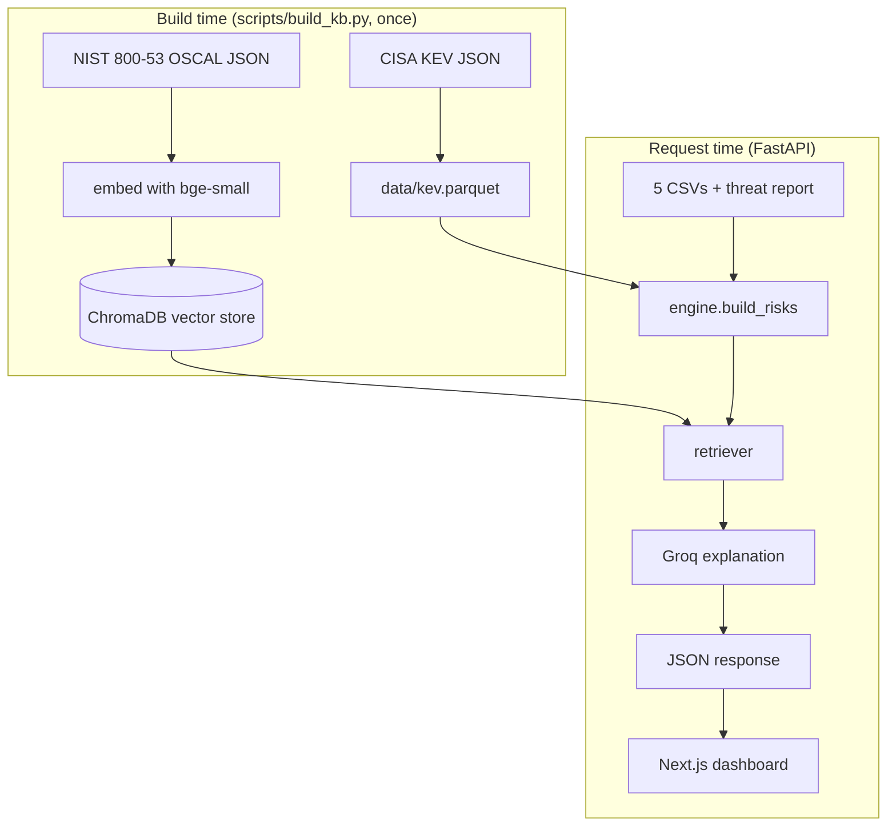
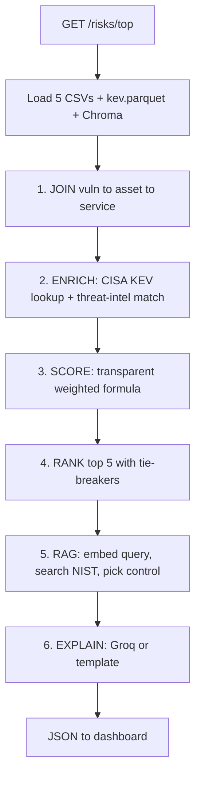
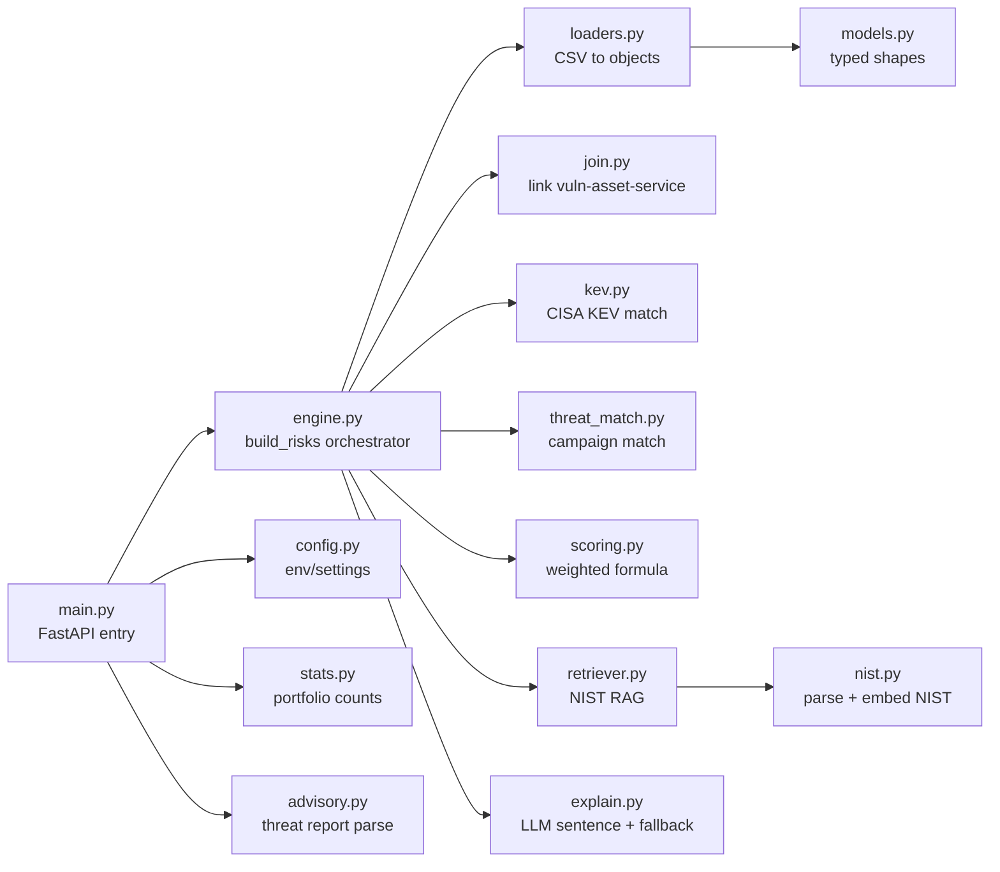
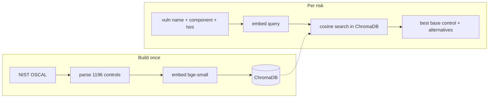
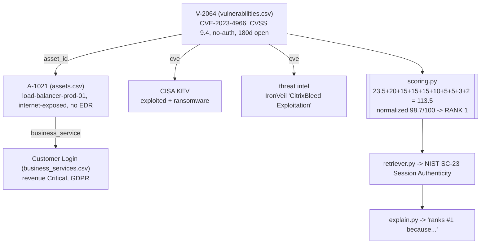

# Project Walkthrough (prep notes)

A complete, plain-English tour of the AI-Powered Cyber Risk Assistant: what the
problem is, how the data flows, which file does what and why, and a worked
example. Written for study/interview prep.

---

## 1. The problem in one paragraph

A fintech (TawasolPay) has its security data spread across five spreadsheets
(assets, vulnerabilities, threat intelligence, business services, remediation
hints) plus an MDR threat advisory. Nobody has joined it into a single ranked,
explainable view. The system does that automatically: it ranks the **top 5
risks** (a "risk" = a vulnerability on a specific asset, in business context),
explains **why** each ranks there, and attaches the most relevant **NIST SP
800-53** remediation control. Ranking is deliberately **not CVSS alone** — it
blends internet exposure, active exploitation, ransomware association, business
criticality, and missing controls.

Two things are evaluated hardest:
1. **The data split** — structured data is *queried* (exact joins/filters); the
   NIST document is *embedded* and retrieved semantically (RAG).
2. **Grounded, not hallucinated** — remediation comes from the real NIST doc; the
   LLM only phrases one sentence.

---

## 2. The data

### The five CSVs (the company's own data, in `Dataset/`)
| File | Rows | What it is | Key columns |
|---|---|---|---|
| `vulnerabilities.csv` | 114 | open security holes (the spine) | `vuln_id, asset_id, cve, cvss, exploit_available, days_open, auth_required` |
| `assets.csv` | 60 | machines/servers | `asset_id, internet_exposed, edr_installed, environment, business_service, criticality` |
| `business_services.csv` | 20 | business context | `business_service, revenue_impact, compliance_scope, rto_hours, depends_on` |
| `threat_intelligence.csv` | 40 | active attacker campaigns | `matched_cve_or_control, campaign_name, threat_actor, ransomware_association` |
| `remediation_guidance.csv` | 30 | one-line fix hints (a hint, not the answer) | `finding_type, recommended_action, priority_hint` |
| `synthetic_threat_report.md` | — | MDR advisory (the "inbox email") | 5 campaigns + prioritisation guidance |

### The two external references (fetched at build time)
- **CISA KEV** (Known Exploited Vulnerabilities): a government table of CVEs
  *actively exploited in the wild*, with a `knownRansomwareCampaignUse` flag.
  Answers *"is this dangerous right now?"*. Queried by exact CVE.
- **NIST SP 800-53 Rev. 5**: the catalog of ~1,196 security controls (the fix
  rulebook). Answers *"what should we do about it?"*. Embedded for semantic search.

---

## 3. Architecture (build time vs request time)



- **Build time** produces two artifacts: `kev.parquet` (structured) and the
  Chroma vector store (semantic). Run once, baked into the Docker image.
- **Request time** loads the CSVs, joins/enriches/scores/ranks, retrieves NIST
  per risk, phrases the explanation, and returns JSON.

---

## 4. The request pipeline (what `GET /risks/top` does)



The whole result is cached (`@lru_cache`) so this runs once per process.

---

## 5. File-by-file: what and why

### Backend (`backend/app/`)


| File | Responsibility | Why it exists / why separate |
|---|---|---|
| `main.py` | FastAPI app + endpoints (`/health`, `/risks/top`, `/stats`, `/advisory`). The **entry point** (`uvicorn app.main:app`). Caches results. | Thin HTTP layer; keeps orchestration out of the web plumbing. |
| `config.py` | Reads env vars (`GROQ_API_KEY`, `GROQ_MODEL`, paths), loads `.env`. | One place for configuration; secrets never hard-coded. |
| `models.py` | Pydantic types (`Asset`, `Vulnerability`, `ThreatIntel`, `BusinessService`, `RemediationHint`). | Validates data at the boundary; downstream code uses typed fields, not raw strings. |
| `loaders.py` | Reads each CSV into those typed objects. | Isolates all file parsing in one place. |
| `join.py` | Links each vuln to its asset (`asset_id`) and service (`business_service`). | Turns a raw finding into a contextual risk. |
| `kev.py` | Fetches CISA KEV, stores `kev.parquet`, matches a CVE (exploited? ransomware?). | The external "is it exploited now" signal, cross-referenced by exact CVE. |
| `threat_match.py` | Indexes threat intel by CVE, matches a risk to an active campaign (ignores the noise records). | Adds the "someone is actively attacking this" signal. |
| `scoring.py` | The transparent weighted formula -> `score` + `breakdown`. **The heart.** | Explainable, auditable, reproducible ranking (not a black box). |
| `engine.py` | `build_risks()` orchestrates join -> enrich -> score -> rank -> retrieve -> explain; defines `RankedRisk`, `NistControl`, `normalized_score`, `alternative_controls`, `cve_concentration`. | The spine; the one place the whole pipeline is assembled. |
| `nist.py` | Fetches + parses NIST OSCAL, embeds controls into ChromaDB. Constants `MODEL`, `COLLECTION`. | Builds the semantic knowledge base for RAG. |
| `retriever.py` | Per risk: builds a query, embeds it, searches Chroma, returns best NIST control + alternatives. | The retrieval half of RAG. |
| `explain.py` | The "why it ranks here" sentence via Groq/Qwen, with a deterministic template fallback. | Last-mile phrasing; LLM constrained to facts, never decides ranking. |
| `stats.py` | Portfolio summary counts (assets, exposed, KEV, ransomware, campaigns). | Feeds the dashboard's top summary strip. |
| `advisory.py` | Parses `synthetic_threat_report.md` into raw markdown + campaign list. | Satisfies "ingest the threat report"; shown as the advisory that triggered the assessment. |

### Supporting
| Path | Role |
|---|---|
| `backend/scripts/build_kb.py` | One-time build: fetch KEV + NIST, create `kev.parquet` + Chroma store. |
| `backend/eval/` | RAG evaluation: `golden_set.py` (labelled cases) + `evaluate_rag.py` (Hit-rate@k, MRR, dense vs hybrid). |
| `backend/tests/` | pytest suite; also the clearest spec of each module's behaviour. |
| `backend/data/` | Built artifacts (gitignored). |

### Frontend (`web/`)
| Path | Role |
|---|---|
| `app/page.tsx` | Fetches `/risks/top`, `/stats`, `/advisory`; renders the dashboard; computes the executive-summary line. |
| `app/components/RiskCard.tsx` | One ranked risk: header, meta, scoring drivers, NIST, collapsible evidence. |
| `app/components/ScoreBreakdown.tsx` | The itemised per-factor scoring drivers. |
| `app/components/StatBar.tsx` | The portfolio summary strip. |
| `app/components/AdvisoryPanel.tsx` | The MDR advisory panel. |
| `lib/api.ts` | `getTopRisks`, `getStats`, `getAdvisory` fetchers. |
| `lib/types.ts` | TypeScript mirror of the API payload. |

---

## 6. The scoring formula (scoring.py)

```
weighted score = (CVSS / 10) * 25            # base severity, max 25
   + 20  internet-exposed (asset-level source of truth)
   + 15  exploit available OR present in CISA KEV
   + 15  ransomware-associated in CISA KEV
   + 15  matched to an active threat campaign
   + 10 / 6 / 3  business revenue impact (Critical / High / Medium)
   + 5 / 3  compliance scope (5: GDPR/PCI DSS/UAE PDPL; 3: ISO 27001/SOC 2/IFRS)
   + 5  no EDR   + 3  no auth required   + 2  open > 30 days
```

- Only factors that fire are added and recorded in `breakdown` (traceability).
- Not clamped; ranked descending with tie-breakers (revenue -> CVSS -> days open
  -> production over staging -> vuln_id).
- Displayed as `normalized_score = raw / 115 * 100` (a clean 0-100 that preserves
  order; 115 is the theoretical max).

Weights follow the MDR advisory's stated priority order, so the report is the
literal rationale for the ranking.

---

## 7. The RAG flow (nist.py + retriever.py)



- **Dense** semantic retrieval (bge-small-en-v1.5), no PyTorch-free hybrid needed
  (BM25 hybrid was measured and did not help; see `eval/`).
- The remediation-hint CSV is used only to *shape the query*; the returned text
  is the real NIST control prose.

---

## 8. What the LLM does (and does not do)

- **Does:** write ONE plain-English "why it ranks here" sentence, constrained to
  the already-computed facts (rank, score breakdown, asset, CVE, service, KEV,
  campaign). Prompt forbids inventing anything or recommending fixes.
- **Does NOT:** decide the ranking, compute the score, choose the NIST control,
  or produce any fact. Those are deterministic.
- **Fallback:** if no key / error / rate-limit, a deterministic template sentence
  is used. The output never breaks.

---

## 9. Worked example: why CitrixBleed is #1



| Factor | From | Points |
|---|---|---|
| CVSS 9.4 base | vulnerabilities.csv | +23.5 |
| internet-exposed | assets.csv | +20 |
| exploit / in KEV | vulns + KEV | +15 |
| ransomware (KEV) | CISA KEV | +15 |
| active campaign | threat_intelligence.csv | +15 |
| business criticality | business_services.csv (revenue Critical) | +10 |
| compliance (GDPR) | business_services.csv | +5 |
| no EDR | assets.csv | +5 |
| no auth required | vulnerabilities.csv | +3 |
| open > 30 days | vulnerabilities.csv | +2 |
| **raw total** | | **113.5 -> 98.7/100 -> #1** |

Contrast: an internal dev-server CVSS 10 with nothing else scores ~25, so it
ranks far below. That is the "not CVSS alone" behaviour.

---

## 10. Entry points recap
- **Build once:** `python backend/scripts/build_kb.py` (KEV + NIST -> artifacts).
- **Serve:** `uvicorn app.main:app` -> the FastAPI `app` in `backend/app/main.py`.
- **Endpoints:** `/risks/top`, `/stats`, `/advisory`, `/health`, `/docs`.
- **Frontend:** Next.js in `web/`, calls the API and renders the dashboard.

## 11. How to study it (reading order)
1. `README.md` + the CSV headers in `Dataset/`.
2. `models.py` -> `loaders.py` (data shapes).
3. `join.py` -> `kev.py` -> `threat_match.py` -> `scoring.py` (logic).
4. `engine.py` (the orchestrator).
5. `nist.py` -> `retriever.py` -> `explain.py` (RAG + LLM).
6. `main.py` (endpoints). Then `web/lib/types.ts` -> `page.tsx` -> `RiskCard.tsx`.
7. Read `tests/` as executable documentation; run the app and hit `/docs`.
